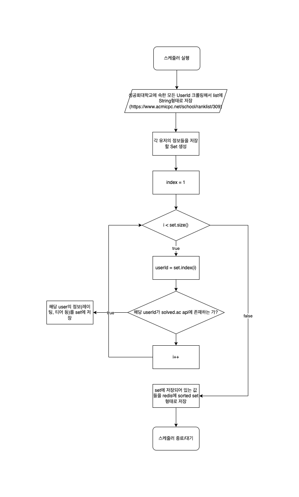

# Solvedac Leader Board Projcet

## 설명

Solvedac api를 이용해 학교/회사의 리더보드를 구성

Redis의 sorted set 자료구조를 이용해서 데이터를 보다 빠르게 제공

## 만들게 된 계기

<pre>
baekjoon 사이트에서 학교/회사에서의 유저들의 랭킹은 맞은 문제 수 기준으로 리더보드가 구성이 되어있습니다.
solved.ac는 Baekjoon Online Judge 문제들에 태그와 난이도를 붙이는 프로젝트인데 
맞은 문제 순이 아니라 solved.ac에서 제공한 문제들의 경험치를 바탕으로 성공회대학교의 리더보드 api를 구성하려고 합니다.
<a href="https://solvedac.github.io/unofficial-documentation/#/">solved.ac Api 문서</a>에서는 유저의 정보를 불러와 경험치를 알 수 있지만 제가 만들고자 하는 기능은 없습니다.
</pre>

## 사용한 기술

## Flow Chart

